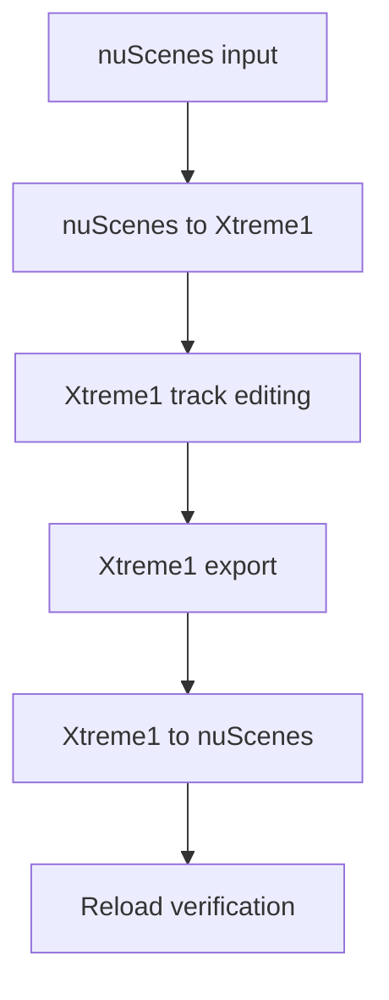

# nuScenes–Xtreme1 Round-Trip Converter

This project provides a practical round-trip workflow between the nuScenes autonomous-driving dataset and Xtreme1:

1. Convert a nuScenes scene into an Xtreme1 `LIDAR_FUSION` ZIP.
2. Review or delete object tracks in Xtreme1.
3. Export the edited Ground Truth annotations.
4. Apply track deletions to a new, valid nuScenes dataset copy.
5. Reload the converted nuScenes output into Xtreme1 for verification.


[](https://gitdiagram.com/harunaacar/nuscenes-xtreme1-roundtrip?utm_source=readme&utm_medium=picture)

## Features

- Converts nuScenes LiDAR `.bin` files to binary PCD.
- Packages one LiDAR and six camera streams for Xtreme1.
- Generates camera intrinsic and LiDAR-to-camera extrinsic configuration.
- Transforms nuScenes global 3D cuboids into the LiDAR coordinate system.
- Preserves object identity by mapping `instance_token` to Xtreme1 `trackId`.
- Creates stable numeric `trackName` values for the Xtreme1 Instances panel.
- Creates missing Xtreme1 `CUBOID` classes in a selected local dataset.
- Detects annotations and complete tracks removed in Xtreme1.
- Rebuilds nuScenes `prev`/`next` annotation chains and `instance.json` references.
- Produces a JSON report listing removed instances.

## Repository Structure

```text
nuscenes-xtreme1-roundtrip/
├── scripts/
│   ├── nuscenes_to_xtreme1.py
│   └── xtreme1_to_nuscenes.py
├── examples/
│   └── xtreme1_roundtrip_report.json
├── README.md
├── requirements.txt
└── .gitignore
```

The nuScenes dataset, Xtreme1 export ZIPs, generated PCD files and converted output directories are intentionally not included.

## Requirements

- Python 3.10 or newer
- Docker Desktop
- A local Xtreme1 installation
- nuScenes `v1.0-mini` or another compatible nuScenes version

Install the Python dependencies:

```powershell
py -3.12 -m pip install -r requirements.txt
```

Start Xtreme1 from the directory containing `docker-compose.yml`:

```powershell
docker compose up -d
```

Open Xtreme1 at [http://localhost:8190](http://localhost:8190).

## 1. Convert nuScenes to Xtreme1

Create an empty `LIDAR_FUSION` dataset in Xtreme1, then run:

```powershell
py -3.12 ".\scripts\nuscenes_to_xtreme1.py" `
  --dataroot "C:\datasets\nuscenes" `
  --version v1.0-mini `
  --scene-index 0 `
  --max-frames 39 `
  --compose-file "C:\tools\xtreme1\docker-compose.yml" `
  --output ".\outputs\nuscenes_import.zip"
```

If more than one `LIDAR_FUSION` dataset exists, the script lists the datasets and asks for the target dataset ID. The selected ID must belong to the dataset into which the ZIP will be uploaded.

Upload the generated ZIP and select:

```text
Contains annotation result → Ground Truth
```

## 2. Edit Tracks in Xtreme1

Open the imported scene, select an object and use:

```text
Delete this object → All frames
```

Save or submit the changes, then export the Ground Truth annotation result from Xtreme1.

## 3. Apply Xtreme1 Deletions to nuScenes

Run the reverse converter using the original nuScenes dataset and the Xtreme1 export ZIP:

```powershell
py -3.12 ".\scripts\xtreme1_to_nuscenes.py" `
  --dataroot "C:\datasets\nuscenes" `
  --version v1.0-mini `
  --xtreme1-export ".\exports\CarLabel-export.zip" `
  --scene scene-0061 `
  --out ".\outputs\nuscenes_output"
```

The original dataset is not modified. The script creates a new dataset copy and updates:

- `sample_annotation.json`
- `instance.json`

It also creates:

```text
xtreme1_roundtrip_report.json
```

Example terminal output:

```text
Silinen annotation: 35 | tamamen kaldırılan instance: 2
Tamamen kaldırılan instance'lar:
  <instance_token> | vehicle.truck | eski annotation: 20
  <instance_token> | vehicle.car   | eski annotation: 15
```

## 4. Reload Verification

Create another empty Xtreme1 `LIDAR_FUSION` dataset and convert the new nuScenes output:

```powershell
py -3.12 ".\scripts\nuscenes_to_xtreme1.py" `
  --dataroot ".\outputs\nuscenes_output" `
  --version v1.0-mini `
  --scene-index 0 `
  --max-frames 39 `
  --compose-file "C:\tools\xtreme1\docker-compose.yml" `
  --output ".\outputs\nuscenes_reload.zip"
```

Upload `nuscenes_reload.zip` to the new dataset with Ground Truth annotations enabled. The deleted tracks should no longer appear in any frame.

The generated nuScenes dataset can also be validated with the official devkit:

```python
from nuscenes.nuscenes import NuScenes

nusc = NuScenes(
    version="v1.0-mini",
    dataroot=r"C:\path\to\nuscenes_output",
    verbose=True,
)

print("Annotations:", len(nusc.sample_annotation))
print("Instances:", len(nusc.instance))
```

## Identity Mapping

The round trip depends on one stable identity mapping:

```text
nuScenes instance_token
        ↓
Xtreme1 trackId
        ↓
Xtreme1 exported trackId
        ↓
nuScenes instance_token
```

For each frame, the reverse converter compares the original `instance_token` values with the remaining exported `trackId` values. Missing annotations are removed from the output metadata. If an instance has no remaining annotations, its `instance.json` record is removed as well.

## Coordinate Transformations

The forward converter uses the nuScenes ego pose and calibrated sensor records:

```text
T_global_lidar = T_global_ego × T_ego_lidar
T_camera_lidar = inverse(T_global_camera) × T_global_lidar
T_lidar_box = inverse(T_global_lidar) × T_global_box
```

The resulting box center, dimensions and Euler rotation are written in Xtreme1's LiDAR coordinate system.

## Current Limitations

Supported:

- Deleting a complete track across all frames
- Deleting an annotation from an individual frame
- Preserving unchanged tracks and nuScenes metadata relationships

Not yet applied to the reverse conversion:

- New objects created in Xtreme1
- Cuboid position, size or rotation changes
- Class changes

The reverse converter currently treats the original nuScenes metadata as the geometry source and the Xtreme1 export as the source of truth for annotation existence.

## Data and Security

Do not commit:

- nuScenes sensor data or metadata archives
- Xtreme1 export ZIPs
- Generated dataset copies
- API keys, database passwords or signed object-storage URLs

Review staged files before pushing the repository publicly.

## References

- [nuScenes](https://www.nuscenes.org/)
- [nuScenes devkit](https://github.com/nutonomy/nuscenes-devkit)
- [Xtreme1](https://github.com/xtreme1-io/xtreme1)
